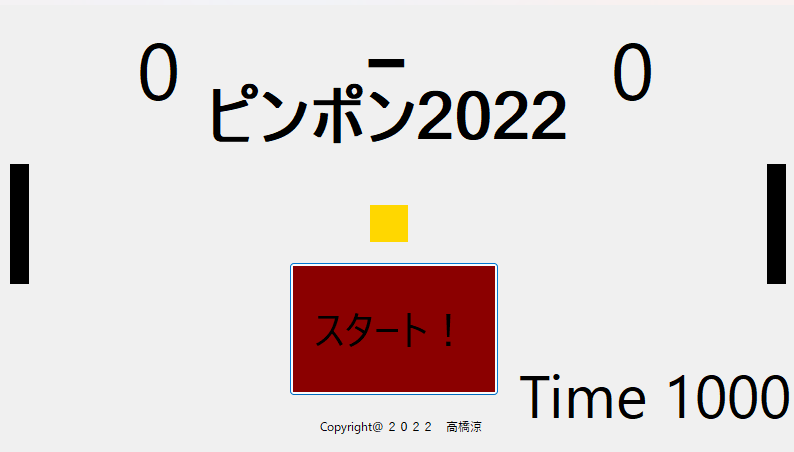
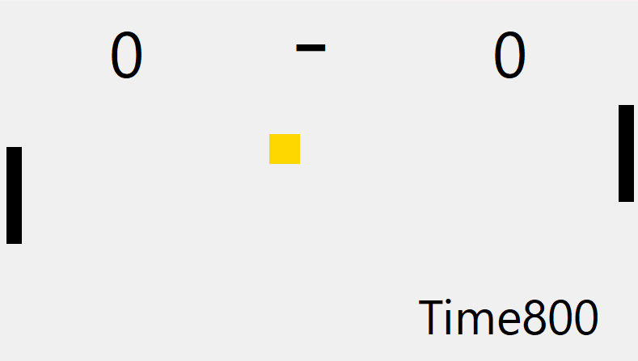

# pinnponn
 
 ==============================================================================
- 作品名　：pinnponn
- 著作者　：高橋涼 (@ryotakahasi-da22)
- 開発環境：Windows10 + Visual Studio 2022 + Visual Studio 2019
- 動作環境：Visual Studio
- 開発期間：2022/8/1-2022/8/10(10日)
- 開発人数：一人
- 担　　当：プログラム
==============================================================================
 
 
 
 
 
### ゲームの概要
1. ボールを跳ね返してクリアを目指す対戦ゲーム

### 操作方法
1. マウスを操作
2. ボタンは左クリックで押せる

### 遊び方
1. Timr１０００以内に先に２点をとったほうの勝ちになる。
2. 左にあるバーをボールにあててボールを上手く相手に跳ね返す。

# 改良版（ほとんど一緒です）
- [改良版のページを開く](https://github.com/ryotakahasi-dat22/pinnponn3)

# 更新履歴
- 8月31日 最初の公開
